# Manna AI machine index

MANDATORY: read this file first every session.

## Identity

- Repo: `Guebbit/manna`
- Stack: TypeScript (strict), Node.js >=18, ESM (`tsx`)
- Topology: flat monorepo (`apps/`, `packages/`, `tests/`), relative imports

## System

- Local-first Ollama agent server (not chatbot UI)
- Core endpoints:
    - Agent loop: `POST /run`, stream: `POST /run/stream`
    - Swarm: `POST /run/swarm`, `POST /run/swarm/stream`
    - Workflow: `POST /workflow`, `POST /workflow/stream`
    - IDE direct (no loop): `/autocomplete`, `/lint-conventions`, `/page-review`
    - Info (no LLM): `/info/modes`, `/info/models`, `/help`

## Execution graph (`POST /run`)

```mermaid
flowchart TD
    POST["HTTP POST /run { task, allowWrite?, profile? }"]
    POST --> API["apps/api/index.ts"]
    API --> Validate["validates profile against fast|reasoning|code|default"]
    API --> Select["selects Agent instance (readOnly or writeEnabled)"]
    API --> Run["agent.run(task, { profile? })"]

    Run --> GetMem["getMemory(task) ← packages/memory/memory.ts"]
    Run --> EmitStart["emit('agent:start')"]

    subgraph LOOP["LOOP (max MAX_STEPS, default 5)"]
        ProcInput["processInputStep processors\n(e.g. tool-reranker filters tools)"]
        BuildPrompt["buildPrompt(task, context, memory)"]
        RouteModel["routeModel(task, context, step, contextLength, cumulativeDurationMs)"]
        RouteModel --> Forced{"forcedProfile set?"}
        Forced -->|Yes| ReturnImm["return it immediately (no LLM cost)"]
        Forced -->|No| BudgetCheck{"budget heuristics?"}
        BudgetCheck -->|"context > 80% ceiling"| ReasoningProfile["use reasoning (larger ctx)"]
        BudgetCheck -->|"duration > 70% ceiling"| FastProfile["use fast (finish quickly)"]
        BudgetCheck -->|No budget trigger| Mode{"router mode?"}
        Mode -->|rules| Keywords["keyword + heuristic match"]
        Mode -->|model| RouterLLM["calls ROUTER_MODEL with JSON prompt + budget state"]

        Generate["generateWithMetadata(prompt, { model })"]
        Parse["parse response → agentStepSchema (Zod)"]
        Parse -->|"parse failure"| Correct["append correction to context\nrecord json diagnostic entry\ncontinue"]
        Correct --> ProcInput
        ProcOutput["processOutputStep processors\n(e.g. verification gate)"]
        Verify{"AGENT_VERIFICATION_ENABLED?"}
        Verify -->|"true + action≠none"| VerifyLLM["lightweight LLM check: valid tool choice?"]
        VerifyLLM -->|"valid=false"| AppendIssue["append issue to thought\nemit tool:verification_failed"]
        VerifyLLM -->|"valid=true"| ActionCheck

        ActionCheck{"action?"}
        ActionCheck -->|"'none'"| AddMem["addMemory(...)"]
        AddMem --> EmitDone["emit('agent:done')"]
        EmitDone --> DiagLog["writeDiagnosticLog if entries > 0"]
        DiagLog --> ReturnAnswer["return thought ← final answer"]

        ActionCheck -->|"unknown"| AppendErr["append error to context\nrecord tool diagnostic\ncontinue"]
        AppendErr --> ProcInput

        ActionCheck -->|"tool name"| ToolExec["tool.execute(input)"]
        ToolExec -->|success| ToolOk["append result to context, emit('tool:result')"]
        ToolExec -->|failure| ToolFail["append error to context\nrecord tool diagnostic\nemit('tool:error')"]
        ToolOk --> ProcInput
        ToolFail --> ProcInput

        ProcInput --> BuildPrompt --> RouteModel
        ReturnImm --> Generate
        ReasoningProfile --> Generate
        FastProfile --> Generate
        Keywords --> Generate
        RouterLLM --> Generate
        Generate --> Parse --> ProcOutput --> Verify --> ActionCheck
        AppendIssue --> ActionCheck
    end

    EmitStart --> LOOP
    GetMem --> LOOP
    LOOP -->|"loop exhausted"| SelfDebug["generate self-debug summary (FAST_MODEL)"]
    SelfDebug --> SaveMem["addMemory MAX_STEPS summary"]
    SaveMem --> WriteDiag["writeDiagnosticLog with AI commentary"]
    WriteDiag --> MaxSteps["emit('agent:max_steps', {task, summary, diagnosticFile})"]
    MaxSteps --> ReturnSummary["return AI-generated summary"]
```



## Structured output contract (hard requirement)

```ts
// packages/agent/schemas.ts
{
    thought: string; // min length 1
    action: string; // tool name OR "none"
    input: Record<string, unknown>; // forwarded to tool.execute()
}
```

- Validate with Zod `agentStepSchema`
- Parse failure => append correction context + retry same step slot

## Core invariants / safety

- `shell`: allowlist-only commands
- `mysql_query`: `SELECT` only
- `read_*` + `write_file`/`scaffold_project` + `document_ingest`: path-safe under repo root
- Write tools register only when request has `allowWrite:true`
- `knowledge_graph`: write-only tool, fail-open if Neo4j down
- `query_knowledge_graph`: read-only, blocks mutating Cypher keywords, fail-open if Neo4j down
- Unknown tool names: append error + retry, no crash
- Invalid LLM JSON/schema: self-correct + retry, no crash
- Qdrant/MCP/verification/reranker failures: fail-open, no process crash
- Diagnostic files constrained to `DIAGNOSTIC_LOG_DIR` via safe path checks
- Persistence failures logged/ignored (`.catch()` in run paths), never crash run

## Routing + model fallback summary

- Profiles: `fast|reasoning|code|default`
- Router mode (`AGENT_MODEL_ROUTER_MODE`): `rules` (default) or `model`
- Fallback chain per profile: profile var -> `AGENT_MODEL_DEFAULT` -> `OLLAMA_MODEL` -> `llama3`

## Update protocol (compact)

When codebase changes, update `.ai/*` docs with no stale references.

- model changes -> update `.ai/MODELS.md` + `.ai/ENVVARS.md` defaults
- tool add/remove/rename -> update `.ai/TOOLS.md` + `.ai/STRUCTURE.md` + invariants here
- endpoint changes -> update this file graph/tables + `openapi.yaml` + `CHANGELOG.md`
- env var changes -> update `.ai/ENVVARS.md`
- directory moves -> update `.ai/STRUCTURE.md`
- always recheck structured output contract vs `packages/agent/schemas.ts`
- run `npm run complete:check`

## Load-on-demand map

- Model/hardware decisions -> `.ai/MODELS.md`
- Tool inventory/registration/MCP lifecycle -> `.ai/TOOLS.md`
- Environment variables/defaults -> `.ai/ENVVARS.md`
- Directory map/modification patterns/tests -> `.ai/STRUCTURE.md`
- Style/naming/comments/diagram rules -> `.ai/STYLE.md`
