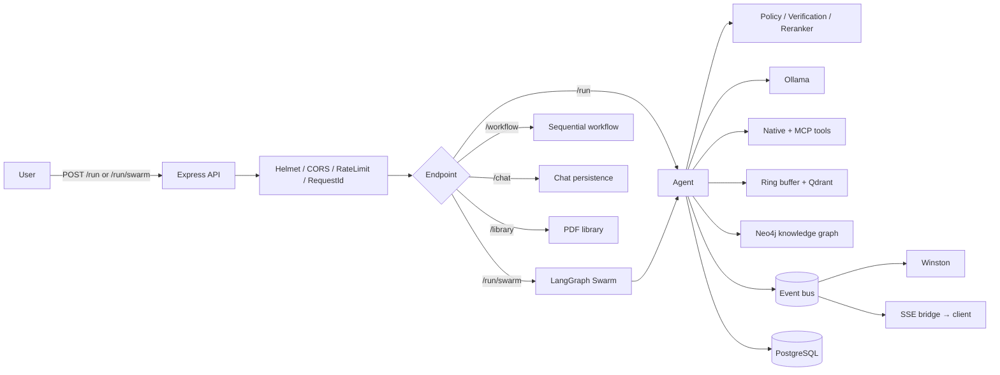

# Manna — AI source of truth

> **MANDATORY for every AI session.** Read this file first, before any task.
> This file is the **single source of truth** for what Manna is, how it is built,
> which patterns it uses, and which other files own which concerns. If anything
> in the codebase or other documentation conflicts with this file, fix the
> conflicting source — never let drift accumulate.
>
> **No backward compatibility.** Manna is in alpha; prefer the cleanest SOLID/KISS
> change over any compat shim.

---

## 1. Identity

| Field         | Value                                                        |
| ------------- | ------------------------------------------------------------ |
| Name          | Manna                                                        |
| Package       | `@guebbit/manna` (`0.15.0-alpha`, private monorepo)          |
| Tagline       | Personal AI Agent Platform — local-first, extensible         |
| Author / org  | `Guebbit` (single-maintainer codebase)                       |
| Runtime       | Node.js ≥ 18, pure ESM (`"type": "module"`)                  |
| Language      | TypeScript 5.8, `strict`, `tsc --noEmit` as build gate       |
| API entry     | `apps/api/index.ts` (Express, default `PORT=3001`)           |
| Core endpoint | `POST /run` (agent loop)                                     |
| Deployment    | Docker / Podman Compose (`docker-compose.yml`)               |
| Docs site     | VitePress in `docs/`                                         |
| Philosophy    | Local-first · No-magic · Observable · Fail-open · Extensible |

---

## 2. What Manna does

Agentic backend service. Accepts a natural-language task over HTTP and returns
a final answer after the agent reasons, calls the right tools, and (optionally)
coordinates multiple sub-agents.

Capabilities:

- Autonomous **agent loop** (`POST /run`, SSE variant `/run/stream`).
- **Swarm orchestration** via LangGraph (`POST /run/swarm[/stream]`).
- **Ordered workflows** with controlled context carry (`POST /workflow[/stream]`).
- **IDE direct-LLM endpoints**: `/autocomplete`, `/lint-conventions`, `/page-review`.
- **Chat persistence**: `/chat/conversations/...` (PostgreSQL).
- **File uploads**: `/upload/image-classify|image-sketch|image-colorize|speech-to-text|read-pdf`.
- **Knowledge**: Qdrant vector memory + Neo4j knowledge graph (GraphRAG).
- **Library**: multi-library PDF ingestion + semantic article search (`/library/...`).
- **Instance metadata**: `/info/modes`, `/info/models`, `/help`, `/health`.
- **Error logs**: `/logs/errors` — read-only access to structured Winston error entries.
- **MCP integration**: external Model Context Protocol servers loaded at startup.

The REST contract is owned by **[`openapi.yaml`](../openapi.yaml)** (Spectral-linted).

---

## 3. Stack (runtime)

- **Express 4** + Helmet + CORS + `express-rate-limit` + Multer + request-ID middleware.
- **Ollama** local LLM (`packages/llm/ollama.ts`) — `generate`/`chat` plus `…WithMetadata`.
- **Embeddings** via Ollama (`packages/llm/embeddings.ts`).
- **LangChain Core** message types + **LangGraph** `StateGraph` (swarm).
- **Qdrant** (vector memory), **Neo4j** (knowledge graph), **PostgreSQL** (primary persistence).
- **MySQL** and **MongoDB** are supported only as _tool targets_ (the agent can query them).
- **Zod** + `zod-to-json-schema` for every LLM-facing schema, tool input, MCP config, API payload.
- **Winston** structured logging (`packages/logger/logger.ts`), **i18next** for user-facing strings.
- **MCP SDK** (stdio + SSE servers).
- **Playwright + Chromium** for the `browser_fetch` tool, **pdf-parse** for PDF reading, **Nodemailer** for outbound mail.

Container services in `docker-compose.yml`: `ollama`, `qdrant`, `postgres`, `neo4j`, `manna`.

---

## 4. Dev tooling — sources of truth

| Concern              | File / command (authoritative)                                                                                                     |
| -------------------- | ---------------------------------------------------------------------------------------------------------------------------------- |
| REST API contract    | [`openapi.yaml`](../openapi.yaml) — linted with `npm run lint:openapi`                                                             |
| TypeScript config    | [`tsconfig.json`](../tsconfig.json) — `tsc --noEmit` (`npm run build`)                                                             |
| Linting              | [`eslint.config.ts`](../eslint.config.ts) — ESLint 10 flat + typescript-eslint + unicorn + oxlint delegation                       |
| Formatting           | [`.prettierrc`](../.prettierrc) / [`.prettierignore`](../.prettierignore)                                                          |
| Tests                | [`vitest.config.ts`](../vitest.config.ts) (unit + integration), [`vitest.eval.config.ts`](../vitest.eval.config.ts) (eval scorers) |
| OpenAPI lint rules   | [`spectral.yaml`](../spectral.yaml)                                                                                                |
| Generated API client | `api/` — regenerate with `npm run genapi`                                                                                          |
| Commit policy        | [`commitlint.config.js`](../commitlint.config.js) (Conventional Commits)                                                           |
| Pre-commit hook      | [`.husky/`](../.husky/) — runs `npm run complete`                                                                                  |
| Container stack      | [`docker-compose.yml`](../docker-compose.yml), [`Dockerfile`](../Dockerfile)                                                       |
| Environment          | [`.env.example`](../.env.example) — canonical env catalogue                                                                        |
| MCP servers          | [`data/mcp-servers.json`](../data/mcp-servers.json)                                                                                |
| SQL migrations       | `packages/persistence/migrations/` — run with `npm run db:migrate`                                                                 |
| Docs site            | `docs/` (VitePress) — checked with `npm run docs:check`                                                                            |

NPM scripts (defined in [`package.json`](../package.json)):

| Script                             | Purpose                                                        |
| ---------------------------------- | -------------------------------------------------------------- |
| `npm run dev`                      | `tsx watch apps/api/index.ts`                                  |
| `npm run build`                    | `tsc --noEmit`                                                 |
| `npm run start`                    | Run compiled `dist/apps/api/index.js`                          |
| `npm run test[:watch/:coverage]`   | Vitest (unit + integration)                                    |
| `npm run test:eval`                | Eval scorers (separate Vitest config)                          |
| `npm run lint[:fix]`               | ESLint                                                         |
| `npm run lint:openapi`             | Spectral over `openapi.yaml`                                   |
| `npm run prettier[:check/:fix]`    | Prettier                                                       |
| `npm run docs:dev/:build/:preview` | VitePress site                                                 |
| `npm run docs:check`               | Tool-doc coverage + internal docs link check                   |
| `npm run db:migrate`               | Apply SQL migrations                                           |
| `npm run genapi`                   | Regenerate typed API client from `openapi.yaml`                |
| `npm run complete`                 | `build && test && lint:fix && prettier:fix` (pre-commit gate)  |
| `npm run complete:check`           | Strict CI gate (adds OpenAPI lint, Prettier check, docs check) |

---

## 5. Repository layout

```
apps/api/           Express HTTP layer (routes, middlewares, SSE bridge)
packages/
  agent/            Reason→act→observe loop, model router, vision capability
  orchestrator/     LangGraph swarm graph (nodes, state)
  swarm/            Task decomposer + swarm result types
  llm/              Ollama client, embeddings, model config
  memory/           Hybrid ring buffer + Qdrant semantic memory
  graph/            Neo4j knowledge graph client + NER extractor
  mcp/              MCP loader + health check
  tools/            Native tool implementations (read/write/exec/...)
  processors/       Middleware: policy, verification, tool-reranker
  persistence/      PostgreSQL pool, SQL migrations, run history
  library/          Multi-library PDF ingestion + semantic article search
  events/           Synchronous in-process event bus
  logger/           Winston root logger
  diagnostics/      Per-run Markdown diagnostic logs
  evals/            Mastra-style scorers + eval persistence
  shared/           Cross-cutting helpers (env, i18n, sse, path-safety,
                    request-validation, response envelope, operating-mode,
                    chunker, math, mailer, llm-response, model-resolution,
                    language detection, errors, safe-read-file)
tests/unit|integration|evals
docs/               VitePress documentation site
api/                Generated typed API client (from openapi.yaml)
scripts/            Docs coverage + link checkers
data/               Runtime data (e.g. mcp-servers.json)
.ai/                AI-only navigation context (this folder)
```

A briefer repo map for AI navigation lives in [`STRUCTURE.md`](./STRUCTURE.md).

---

## 6. Agent loop — `packages/agent/agent.ts`

For each request the `Agent`:

1. Loads relevant memory (ring buffer + Qdrant semantic recall).
2. Runs up to `maxSteps` iterations (from the active operating mode):
    1. `processInputStep` hooks (may inject context, filter tools, hard-stop).
    2. Build a prompt from task + accumulated context + memory + tool catalogue.
    3. Model router selects a profile (or honours the forced one).
    4. Call the LLM; parse the response with Zod (`agentStepSchema`).
    5. `processOutputStep` hooks (may rewrite or block the chosen action).
    6. If `action === "none"` → return; otherwise execute the chosen tool.
    7. `processToolResult` hooks (update error budgets etc.).
    8. Append the result and any **tool citations** to context.
3. Return the final answer + citations + run metadata; persist the run in PostgreSQL.

Supporting modules:

- `packages/agent/model-router.ts` — small-LLM classifier routes to `fast | reasoning | code`;
  budget overrides downgrade to `fast` near time/context limits.
- `packages/agent/vision-capability.ts` + `vision-description.ts` — auto-detects
  multimodal models and pre-describes images.
- `packages/agent/schemas.ts` — Zod step schema (`thought`, `action`, `input`).
- `packages/tools/tool-call-deduplicator.ts` — prevents repeated identical calls.
- `packages/tools/citations.ts` — typed citation buffer accumulated across steps.

---

## 7. Swarm orchestration — `packages/orchestrator/`

`StateGraph`:

```
START → decompose → execute_subtasks → review ─► synthesize → END
                          ▲                │
                          └── retry ◄──────┘
```

- **decompose** — single reasoning-profile call (`packages/swarm/decomposer.ts`) returns structured subtasks.
- **execute_subtasks** — runs each subtask through a fresh worker `Agent` with the same tools/processors.
- **review** — decides whether to retry (up to `SWARM_MAX_REVIEW_RETRIES`) or proceed.
- **synthesize** — combines subtask outputs into the final answer.

---

## 8. Workflows — `apps/api/workflow-endpoints.ts`

Client provides an ordered list of steps; each step is a bounded sub-run. Carry modes:

- `none` — isolated steps.
- `summary` (default) — only a short summary flows.
- `full` — full previous context appended.

---

## 9. Processor middleware — `packages/processors/`

Three lifecycle hooks: `processInputStep`, `processOutputStep`, `processToolResult`.
**PolicyProcessor is always first.**

| Processor     | Module                        | Always on?                        | Role                                                                                 |
| ------------- | ----------------------------- | --------------------------------- | ------------------------------------------------------------------------------------ |
| Policy        | `processors/policy.ts`        | Yes                               | Capability gates (write-tool denial), consecutive-error budget, terminal hard-stops. |
| Verification  | `processors/verification.ts`  | `AGENT_VERIFICATION_ENABLED=true` | Fast-model LLM asks "did the agent pick the right tool?" and injects feedback.       |
| Tool reranker | `processors/tool-reranker.ts` | `TOOL_RERANKER_ENABLED=true`      | Embeds tool descriptions, cosine-similarity reranks, passes top-N tools per step.    |

Typed errors: `PolicyViolationError` (codes like `E_PERMISSION_DENIED`,
`E_CONSECUTIVE_ERRORS`, `E_HARD_STOP_BUDGET`) and `PathSafetyError`.

---

## 10. Native tool catalogue — `packages/tools/`

Tools implement `ITool` (`packages/tools/types.ts`): `name`, `description`,
optional Zod `inputSchema`/`outputSchema`, and `async execute()`. Some tools
opt into `directOutput: true` to short-circuit further LLM rounds.

Read-only tools registered today (`apps/api/agents.ts`):

| Category             | Tools                                                                                              |
| -------------------- | -------------------------------------------------------------------------------------------------- |
| System & code        | `read_file`, `shell`, `code_autocomplete`, `generate_diagram`                                      |
| Document readers     | `read_csv`, `read_json`, `read_markdown`, `read_html`, `read_docx`, `read_pdf`                     |
| Database (query)     | `mysql_query` (via `base-db-tool.ts`)                                                              |
| Web / vision / audio | `browser_fetch` (Playwright), `image_classify`, `image_sketch`, `image_colorize`, `speech_to_text` |
| Retrieval & graph    | `semantic_search`, `query_knowledge_graph`                                                         |

Write tools (registered only when request body has `allowWrite: true`):

- `write_file`, `scaffold_project`, `document_ingest`, `knowledge_graph`.

Tool-side helpers: `tool-builder.ts` (`createTool()`), `tool-reranker.ts`,
`tool-call-deduplicator.ts`, `citations.ts`, `image.processor.shared.ts`,
`base-db-tool.ts` (shared SQL/NoSQL backend).

`pg_query` and `mongo_query` exist as exported tool definitions but are
**not currently wired** into the runtime tool set; treat them as inactive
until added to `apps/api/agents.ts`.

External tools come from **MCP** at startup (`packages/mcp/loader.ts` reads
`data/mcp-servers.json`). Discovery is fail-open — if MCP is unreachable the
agent still boots with only native tools.

AI-only tool reminders live in [`TOOLS.md`](./TOOLS.md).

---

## 11. Memory & retrieval

`packages/memory/memory.ts` is a **hybrid store**:

1. In-process **ring buffer** (`MAX_ENTRIES = 20`) for fast continuity.
2. **Qdrant** collection (`agent_memory` by default) for semantic recall across runs.

`addMemory()` writes; `getMemory(query, k)` reads via Ollama embeddings and
falls back silently to the ring buffer when Qdrant is unavailable.

RAG sits on top via `semantic_search`, `document_ingest` (chunked through
`shared/chunker.ts`), and the Neo4j-backed `knowledge_graph` +
`query_knowledge_graph` tools (NER in `packages/graph/extractor.ts`).

---

## 12. Cross-cutting patterns

- **Fail-open infrastructure** — every external dep (Qdrant, Postgres, Neo4j, MCP, non-critical Ollama) logs a warning and degrades gracefully.
- **Single response envelope** — `successResponse` / `rejectResponse` always return the same JSON shape with `meta` enrichment (`startedAt`, `durationMs`, `requestId`).
- **Zod-validated boundaries** — LLM outputs, tool inputs, MCP configs, API payloads.
- **Event-driven observability** — in-process event bus (`packages/events/bus.ts`) emits `agent:start | step | done | error | max_steps | hard_stop | model_routed | tool:result | tool:error | tool:verification_failed`. The API forwards everything to Winston.
- **SSE streaming bridge** — `apps/api/sse-event-bridge.ts` + `shared/sse.ts` translate bus events into typed SSE events (including `hard_stop`).
- **Per-run diagnostics** — Markdown trace per run in `packages/diagnostics`, with cleanup of old logs.
- **Operating modes** — `AGENT_OPERATING_MODE = low-spec | standard | high-trust` (default `standard`) resolves `{ maxSteps, maxToolCalls, consecutiveErrorLimit, selfDebugEnabled }`; individual env vars override any field.
- **Profile-based model routing** — `fast | reasoning | code`; resolution chain `AGENT_MODEL_<PROFILE>` → `OLLAMA_MODEL` → error. There is **no `default` profile**.
- **Capability gating by request** — write tools only when `allowWrite: true`; enforced by PolicyProcessor.
- **Path safety** — `shared/path-safety.ts` (`resolveSafePath`, `resolveInsideRoot`) and `safe-read-file.ts` constrain every filesystem op; violations throw `PathSafetyError` and consume hard-stop budget.
- **Lazy initialisation** — Postgres pool, Qdrant client, MCP clients connect on first use.
- **No magic** — every decision traceable through structured logs and typed events.

---

## 13. Configuration

`.env.example` is the canonical catalogue. `shared/validateRequiredEnvironment()`
runs on startup and exits if a mandatory variable is missing. Quick reminders
for AI agents live in [`ENVVARS.md`](./ENVVARS.md); model-routing specifics in
[`MODELS.md`](./MODELS.md).

---

## 14. Mental model


```mermaid
flowchart LR
    User -->|POST /run or /run/swarm| API[Express API]
    API --> Middleware[Helmet / CORS / RateLimit / RequestId]
    Middleware --> Router{Endpoint}
    Router -->|/run| Agent
    Router -->|/run/swarm| Orchestrator[LangGraph Swarm]
    Router -->|/workflow| Workflow[Sequential workflow]
    Router -->|/chat| Chat[Chat persistence]
    Router -->|/library| Library[PDF library]
    Orchestrator --> Agent
    Agent --> Processors[Policy / Verification / Reranker]
    Agent --> LLM[Ollama]
    Agent --> Tools[Native + MCP tools]
    Agent --> Memory[Ring buffer + Qdrant]
    Agent --> KG[Neo4j knowledge graph]
    Agent --> Bus[(Event bus)]
    Agent --> Persistence[(PostgreSQL)]
    Bus --> Logger[Winston]
    Bus --> SSE[SSE bridge → client]
```

---

## 15. Topic-specific AI briefs

| File                             | Topic                                                |
| -------------------------------- | ---------------------------------------------------- |
| [`MODELS.md`](./MODELS.md)       | Model routing, profile resolution chain              |
| [`TOOLS.md`](./TOOLS.md)         | Tool interface, registration, `allowWrite` invariant |
| [`ENVVARS.md`](./ENVVARS.md)     | Most-used env var pointers                           |
| [`STRUCTURE.md`](./STRUCTURE.md) | Brief repo map / edit targets                        |
| [`STYLE.md`](./STYLE.md)         | Code/style/comment/JSDoc/naming contract             |

Long-form human documentation lives in `docs/` (VitePress) — start at
[`docs/index.md`](../docs/index.md). It is downstream of this file.
