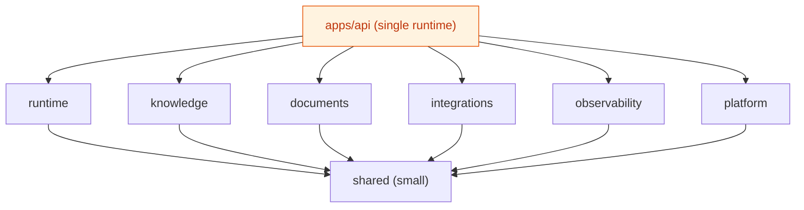

# Capability-Oriented Modular Monolith

::: tip TL;DR
Manna is evolving toward a **capability-oriented modular monolith**: clear internal capability boundaries, one deployable service, no microservices split at this stage.
:::

## Capability map

## Capability areas

| Area            | Brief description                                            | Page                                                       |
| --------------- | ------------------------------------------------------------ | ---------------------------------------------------------- |
| `runtime`       | Agent execution flow: loop, workflows, swarm, policies.      | [/capabilities/runtime](/capabilities/runtime)             |
| `knowledge`     | Memory, graph, retrieval, citation-oriented knowledge logic. | [/capabilities/knowledge](/capabilities/knowledge)         |
| `documents`     | Library ingestion and document parsing/indexing pipelines.   | [/capabilities/documents](/capabilities/documents)         |
| `integrations`  | External adapters: tools, MCP, LLM, browser, DB connectors.  | [/capabilities/integrations](/capabilities/integrations)   |
| `observability` | Events, logger, diagnostics, evals, run visibility.          | [/capabilities/observability](/capabilities/observability) |
| `platform`      | Persistence, config, startup wiring, API support.            | [/capabilities/platform](/capabilities/platform)           |
| `shared`        | Minimal generic helpers only (no domain ownership).          | [/capabilities/shared](/capabilities/shared)               |
