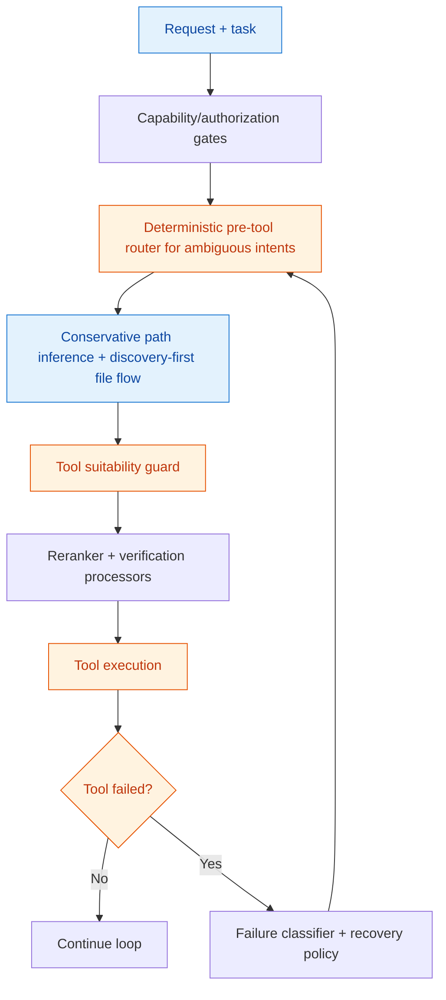

# Tool Selection Strategy Plan (PR roadmap)

::: tip Goal
Define a future-proof, industry-standard plan to make tool selection deterministic when possible, safer under ambiguity, and observable enough to iterate without regressions.
:::

## Why this plan exists

Recent runs showed failure patterns that should be prevented by design:

- ambiguous intent ("Read me the index") mapped to brittle guesses
- hallucinated or unsuitable tool inputs (invented paths/URLs)
- weak recovery after tool failures

This roadmap upgrades selection into a layered contract instead of a single LLM guess.

## Architecture direction (target state)

## Core design decisions

1. **Deterministic pre-tool routing for ambiguous intents**
    - Add a small rule layer before LLM tool execution for high-frequency ambiguous intents (`read/open/show/list/find`).
    - Route to constrained candidate families first (e.g., discovery/read tools before network/browser tools).
    - Keep rules data-driven (config + tests), not prompt-only.

2. **Tool suitability guard (anti-hallucination)**
    - Validate candidate action/input against tool schema + environment + policy before execution.
    - Block invented fields/unsupported tool names early with typed errors.
    - Distinguish "invalid input" from "tool runtime failure" for cleaner retries.

3. **Conservative path inference**
    - Never auto-jump to absolute/external paths unless explicitly requested and allowed.
    - Prefer project-root-relative paths and known safe roots.
    - Require stronger evidence before escalating from relative to inferred absolute paths.

4. **Discovery-before-read flow for ambiguous local files**
    - If file request is underspecified (e.g., `index`), run discovery first (`read_file` directory listing today, `find_files` later).
    - Read only after candidate disambiguation.
    - Emit clear user-facing prompts when multiple candidates exist.

5. **Request-level tool policy controls (guidance + authorization)**
    - Add optional `toolPolicy` contract on `RunRequest`:
        - `allowlist`, `denylist`, `preferred`
        - `mode: guidance | authorization | hybrid`
    - Guidance influences ranking/selection; authorization constrains executable set.
    - Capability gating remains the hard security boundary (request policy cannot bypass platform gates).

6. **Reranker/processor interaction and failure recovery**
    - Apply policy-aware candidate filtering before reranking.
    - Keep processor ordering explicit: policy/capability gate first, reranking and verification after suitability checks.
    - On tool failures, route through a failure-classifier path (path error, schema mismatch, dependency/runtime outage) with bounded retries and fallback.

7. **Future additions**
    - Add `find_files` to reduce fragile path guessing for local discovery.
    - Add `web_search` (separate from page fetch) for "find on the web" intents.
    - Keep both behind explicit capability and policy gates.

## Milestones (implementation phases)

| Phase | Scope                                                                           | Priority | Tradeoffs                                                              |
| ----- | ------------------------------------------------------------------------------- | -------- | ---------------------------------------------------------------------- |
| 0     | Instrumentation baseline: add selection/failure metrics and event fields        | P0       | Fastest risk reduction; no behavior improvement yet                    |
| 1     | Deterministic pre-router + conservative path inference + discovery-before-read  | P0       | Higher implementation complexity, but major UX reliability gain        |
| 2     | Tool suitability guard + typed rejection taxonomy                               | P0       | Slightly more "early 400/tool_error" responses, much safer runtime     |
| 3     | Policy-aware selection pipeline (`toolPolicy` guidance/authorization semantics) | P1       | Requires careful precedence rules to avoid brittle hard-force behavior |
| 4     | Integrate with reranker/verification and failure recovery classifier            | P1       | More moving parts; requires strong observability and test matrix       |
| 5     | Introduce `find_files` + optional `web_search` tools                            | P2       | New capability surface; adds maintenance and policy burden             |

## Observability & maintainability requirements

- Track per-step events: candidate tools, blocked reasons, selected tool, policy mode, reranker top-N, recovery path.
- Maintain typed error codes for guard/policy/path failures.
- Keep strategy components modular (router, guard, policy resolver, recovery classifier) with unit tests per module.
- Add regression scenarios for ambiguous file requests and post-failure reroute behavior.

## Contract status in this PR

- `RunRequest` now includes an optional `toolPolicy` schema in OpenAPI as a planning/contract scaffold.
- Runtime validation accepts normalized `toolPolicy` shape and rejects malformed payloads.
- Execution semantics stay conservative for now; the phased rollout above defines behavior changes.
